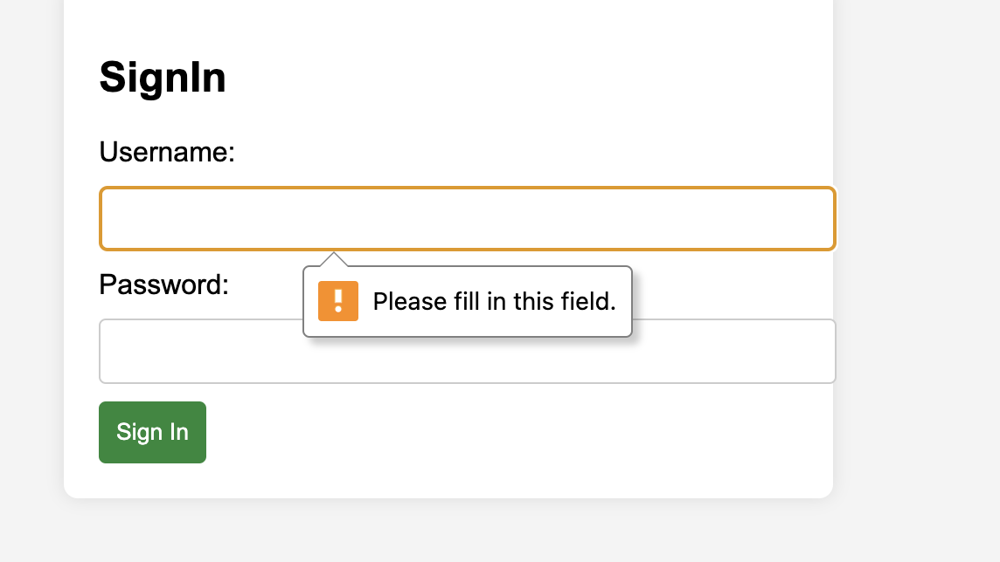
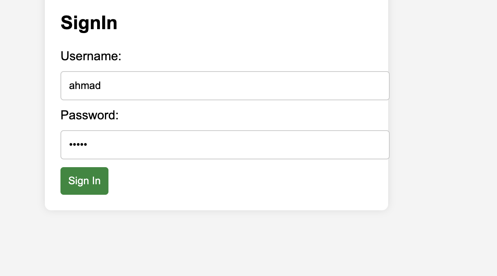
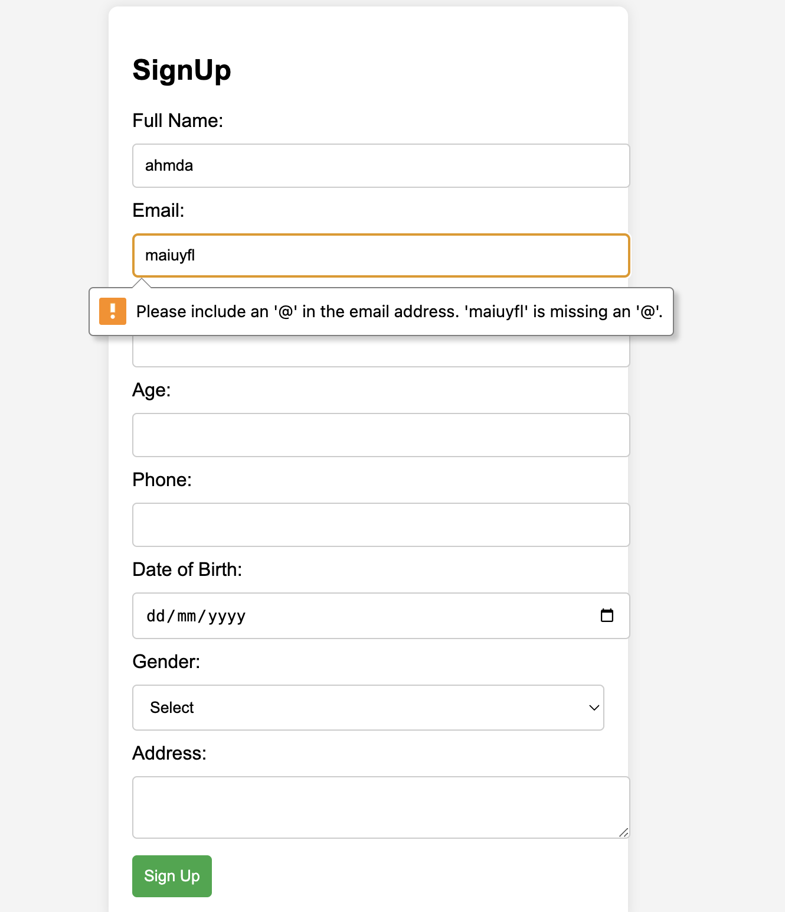
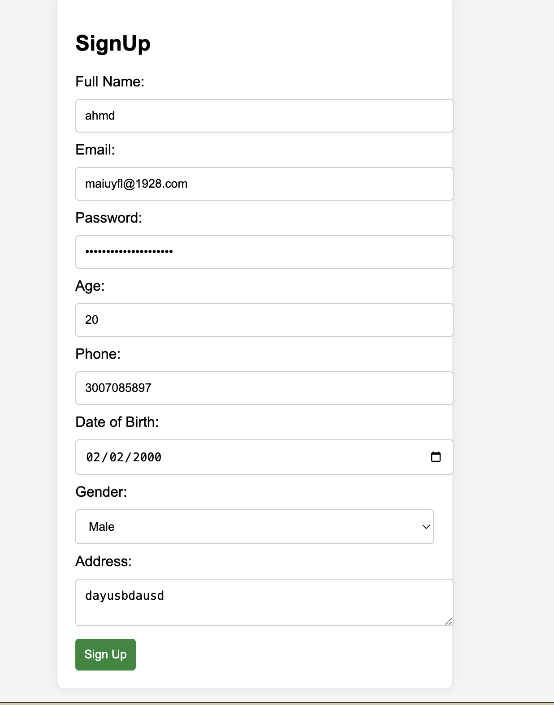
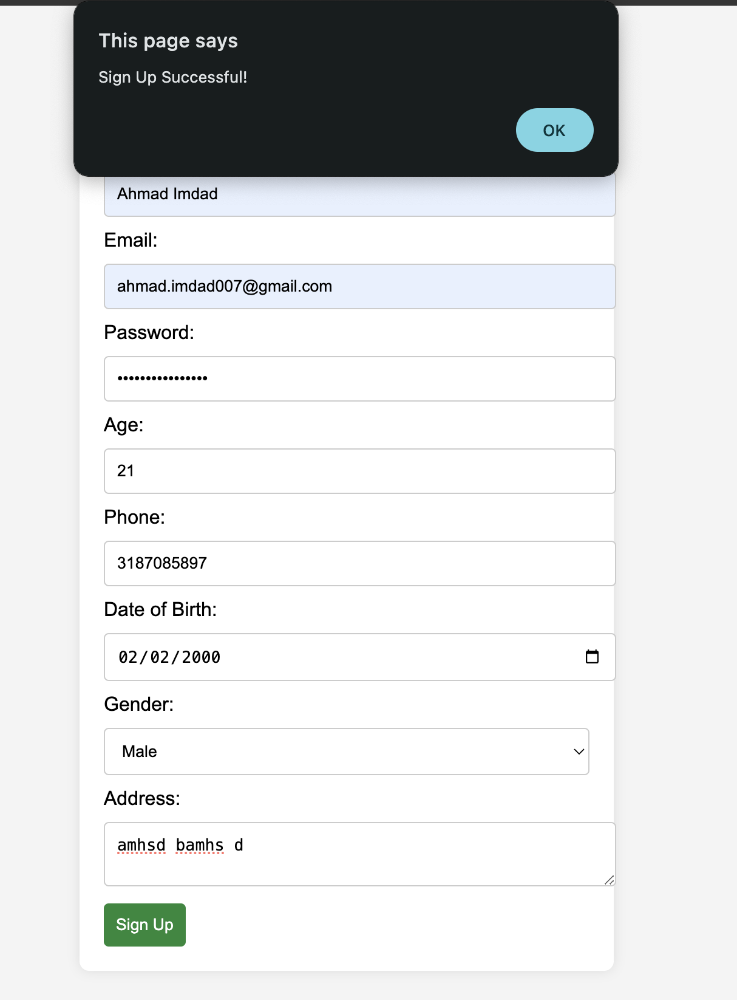

# Web Assignment 2 - Portfolio & Authentication Forms

## 📌 Project Overview
This project is a **web development assignment** consisting of a **Portfolio website** and **Sign-In / Sign-Up authentication forms**. The portfolio showcases projects, while the authentication forms provide a user-friendly login and registration experience.

## 🚀 Features
### 📁 Portfolio
- A simple **index.html** file for the portfolio webpage.
- **Custom CSS and JavaScript** for styling and interactivity.
- Image assets including various `.jpg` and `.png` files to display projects.
- A **structured layout** showcasing work samples.

### 🔐 Authentication (Sign-In & Sign-Up Forms)
- **Sign-In Form**: Allows users to enter their username and password.
- **Sign-Up Form**: Includes full name, email, password validation, phone number, gender selection, date of birth, and address fields.
- **Client-side validation** with JavaScript to ensure correct input formats.
- **CSS styling** for an intuitive UI experience.

## 📂 Project Structure
```
WEB_ASSIGNMENT_2/
│── Portfolio/
│   ├── index.html            # Portfolio main page
│   ├── protofolio.css        # Styling for the portfolio
│   ├── protofolio.js         # JavaScript interactions for the portfolio
│   ├── anime1.jpg            # Image assets
│   ├── anime2.png
│   ├── icon1.jpg.mp4         # Incorrect extension (consider renaming if needed)
│   ├── work1.jpg             # Work showcase images
│   ├── work2.jppg.jpeg       # Possible typo in the extension
│   ├── work3.lpg.jpeg        # Possible typo in the extension
│   ├── work4.jpg
│   ├── wrok process.jog.jpg  # Possible typo (should be work_process.jpg?)
│
│── Sign_In/
│   ├── index.html            # Sign-In form page
│   ├── style.css             # Styling for sign-in page
│   ├── script.js             # JavaScript for sign-in validation
│
│── Sign_Up/
│   ├── index.html            # Sign-Up form page
│   ├── style.css             # Styling for sign-up page
│   ├── script.js             # JavaScript for sign-up validation
```

## 🛠️ Technologies Used
- **HTML5** - Structure of the webpages.
- **CSS3** - Styling and layout of the pages.
- **JavaScript (ES6)** - Form validation and interactive elements.

## 📥 Setup Instructions
1. Clone the repository or download the project files.
   ```sh
   git clone <repository_url>
   ```
2. Open the `index.html` file inside the `Portfolio/`, `Sign_In/`, or `Sign_Up/` folder in a web browser.
3. Ensure JavaScript is enabled in your browser for proper validation.
4. Modify the `protofolio.css` and `protofolio.js` files if needed to customize the portfolio.
5. Check for **image file typos** and correct them if necessary.

## 🖼️ Screenshots
(Add screenshots of your project below by replacing `screenshot.png` with your actual image filenames.)

### Portfolio Homepage:

### Sign-In Page:



### Sign-Up Page:





## 🔧 Future Improvements
- **Fix file naming issues** (`wrok process.jog.jpg`, `work2.jppg.jpeg`, etc.).
- Add **backend authentication** for secure login and registration.
- Implement **responsive design** for better mobile compatibility.
- Enhance **portfolio interactivity** with animations and dynamic content.

---

